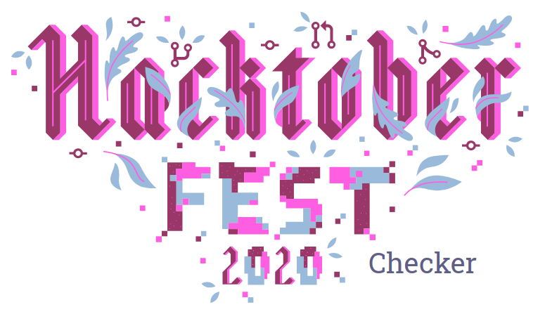

Website for the users to search whether they have qualified for the hacktober fest 20 or not

Check this out at

or

## Code Of Conduct

We are following [**Contributor Covenant Code of Conduct**](.github/CODE_OF_CONDUCT.md).

## MERN BOILERPLATE

This project is bootstrapped from MernBoilerplate.

A minimalist boilerplate for Full Stack MERN developers (Recommended for beginners only). This boilerplate provides basic configurations like:

* Sample CRUD API
* Create-react-app boilerplate
* NPM Scripts needed for MERN Stack
* Sample mongoose connection provided for connecting API with database like mongodb
* Heroku Deployment Configurations

## Contributing Guidelines

Please read our [contributing guidelines here](.github/CONTRIBUTING.md)

## LICENSE

:copyright: TECHOUS 2020
